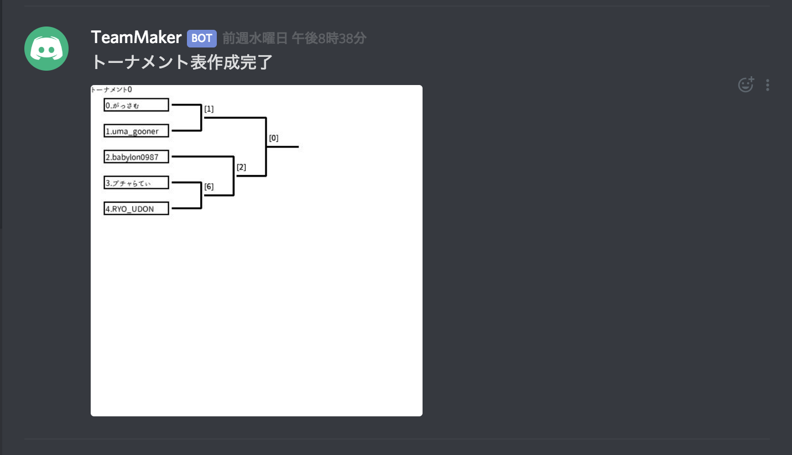
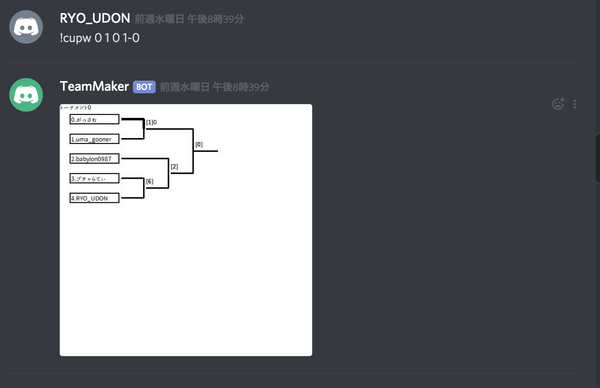

# TeamMaker
Member List Maker Bot for Discord App

編集中　/ Now Editing!
-------------------------

- [TeamMaker](#TeamMaker)
  - [編集中　/ Now Editing!](#%E7%B7%A8%E9%9B%86%E4%B8%AD--Now-Editing)
- [TeamMakerとは / What is TeamMaker](#TeamMaker%E3%81%A8%E3%81%AF--What-is-TeamMaker)
- [TeamMaker使用方法 / How to use TeamMaker](#TeamMaker%E4%BD%BF%E7%94%A8%E6%96%B9%E6%B3%95--How-to-use-TeamMaker)
  - [!start](#start)
  - [!cup](#cup)
    - [!cupw](#cupw)
- [TeamMaker追加方法 / How to invite TeamMaker](#TeamMaker%E8%BF%BD%E5%8A%A0%E6%96%B9%E6%B3%95--How-to-invite-TeamMaker)
  - [家庭用PC(Windows, Macにてインストールする場合)](#%E5%AE%B6%E5%BA%AD%E7%94%A8PCWindows-Mac%E3%81%AB%E3%81%A6%E3%82%A4%E3%83%B3%E3%82%B9%E3%83%88%E3%83%BC%E3%83%AB%E3%81%99%E3%82%8B%E5%A0%B4%E5%90%88)
  - [常時稼働環境の作成 / How to run this bot with raspberry pi](#%E5%B8%B8%E6%99%82%E7%A8%BC%E5%83%8D%E7%92%B0%E5%A2%83%E3%81%AE%E4%BD%9C%E6%88%90--How-to-run-this-bot-with-raspberry-pi)
- [TeamMaker全体構成 / Structure of TeamMaker](#TeamMaker%E5%85%A8%E4%BD%93%E6%A7%8B%E6%88%90--Structure-of-TeamMaker)

# TeamMakerとは / What is TeamMaker
皆さん、ゲームは好きですか？

僕は大好きです。
夜な夜な友人と集まり、サッカーゲームを楽しんでいます。
そんな中、ある日あまりにも人数が集まり過ぎて、紅白戦をすることになりました。

さて、チーム分けをしよう!

...

どうやって？

結局、その場では適当なスマホアプリをインストールしましたが、何度もそれをやるのは面倒!

という個人的な理由から生まれたのがこのTeam Makerです。

TeamMakerとはボイスチャットアプリとして有名な
[Discord](https://discordapp.com/)で動かせるチーム分けBotになります。

使い方は簡単。ただ指定のボイチャチャンネルに参加する人が集まった状態で一言、 **"!start"** とコメントするだけ。
これだけで自動的にチーム分けをしてくれます。

その他にもいろいろと機能があり、今後も追加していく予定です。
まずは使用方法から見てみてください。

-----------------------------------------------------------------------------

Hello guys.

I know most of you love video games.

me?

Offcourse I love it more than you do.
Mostly the game to play with many players.

This [Discord](https://discordapp.com/) Bot named
**TeamMaker** is a bot makes you more easier
to play with your friends, and teammates.

As you send the command **"!start"** in the discord
/general message, TeamMaker will make the 2 team member list
in just a second or so.

If you want to know more about it, please move to below!

# TeamMaker使用方法 / How to use TeamMaker
現在搭載されている機能は２つのチームにランダムで分けてくれることです。
それ以外にも機能はありますが、現在デバッグ中なので、随時追加していきます。

## !start
すでにこのbotをサーバーに入れられている方は友達と一緒にVOICE CHANNELSにあるGeneralに参加して
から以下の画像のように **!start**と打ってください。
するとGeneralに参加したメンバを勝手に2つのチームに分けてくれます。


## !cup
友人たちと熱いトーナメント戦をしたい!! だけどいちいちトーナメント表を作るのは面倒くさい!
そんなあなたに魔法のコマンド!
以下の画像のように **!cup**と打ってみてください。
するとGeneralに参加したメンバを参加者としたトーナメント表を自動で作成して貼り付けてくれます。


### !cupw
ちなみにこのトーナメント表、勝ち負けの判定もできます。
コマンドで **!cupw [トーナメント番号] [ラウンド番号] [買った人のID] [4-2などのスコア]**を打ってもらうと、
下のようになります。

これで面倒な記録も必要なし! いつでもどこでも手軽にトーナメント戦ができるようになります!

~~~~ 随時追記 ~~~~~

# TeamMaker追加方法 / How to invite TeamMaker
## 家庭用PC(Windows, Macにてインストールする場合)
基本的にはいろいろな[ブログ](https://www.devdungeon.com/content/make-discord-bot-python)で掲載されている情報の通り、DeveloperサイトでBotを作成したあと、
自分のサーバに追加してください。
その後、Botのtokenを取得し、TeamSetting.jsonというファイルに追記してください。
このGithubにはsampleとしてSampleSetting.jsonというファイルがSettingディレクトリに
入っていますので、その名前を変更してしてください。

```json : SampleSetting.json
{
    "F1ileName":"TeamSetting.json",
    "Token":"---your token----",
    "ServerName":"---your server---",

    "MainChannel":"General",
    "Channel1":"General",
    "Channel2":"Channel2",

    "Group1":"General",
    "Group2":"Group2"
}
```

基本的に編集が必要なのはこのファイルだけです。
頭から説明すると、
```json
{
    "FileName":"TeamSetting.json",      // この設定ファイルの名前
    "Token":"---your token---",         // ここにDiscord.comにて作成したBotへのアクセスtokenを追加してください。
    "ServerName":"---your server---",   // ここにこのbotを参加させるserverの名前を入れてください。TeamMakerはこのサーバーのみを見に行きます

    "MainChannel":"General"            // チーム分けをする際に最初に全員に入っていてもらうvoice channnelです。
}
```
ここで記載しなかったものについては現在、整備中のものですので気にしないでください。
(今、releaseとdevelopにブランチを分けています.もう少々お待ち下さい)


ここまでくれば後は簡単です。お使いのPCからコマンドで

    sudo pip install discord.py
    sudo pip install pillow

でdiscord.py、PILをインストールしたあと、

    python TeamMaker.py

を実行すればTeamMaker Botを起動することができます。
このTeamMaker.pyはどのディレクトリからでも実行ができます。

もし、これで実行できない場合は
* tokenが間違っていないか
* Condaなどを使わず、通常のPythonを利用する

などを試してみてください。
二個目についてはどうやらDiscord.pyがソケット通信を利用していることが原因で、
Discord.comに接続できないことがあるようです。ちなみに私はMacにAnacondaをインストールして
無事に動きましたが、あとで説明するRasbianでminicondaを入れた際にはいろいろとネットワークの設定を頑張りましたが、うまく接続させることができませんでした。

## 常時稼働環境の作成 / How to run this bot with raspberry pi
現在、私はこのbotを自分のPCからではなく、Raspberry pi 2B+にて常時稼働させています。
PCからでも問題はないのですが、PCそのものをネットワークのつながらないところに持っていくことがあったり、
また、そもそも自分のPCに常時動いてほしくないというワガママから、家の中に眠っていたRaspberry Pi を引っ張りだすことにしました。

ただ、以外と落とし穴が多く存在していたので、念の為情報を残したいと思います。

まず、目指すべき環境は、

**"Raspberry Pi + Python 3.6 ~ + Discord.py"**

になります。
本来であればminicondaなどを入れて環境を作りたいと思ったのですが、
そのせいで逆に環境構築に時間がかかるというなんとも悲しい経験をしたので、ここでは一番シンプルな方法を紹介します。

まず、RasbianのイメージをmicroSDに焼きます。
ここでRasbianをチョイスした理由は、Raspberry Piユーザとしては身近だったことと、
どうやらDiscord.pyを簡単に動かせるようだという前情報を入手したからです。

Raspbianの焼付方法はググればすぐに出てくるので今は割愛します(いずれ追加します)


# TeamMaker全体構成 / Structure of TeamMaker

現在編集中(クラス図などを勉強中)


